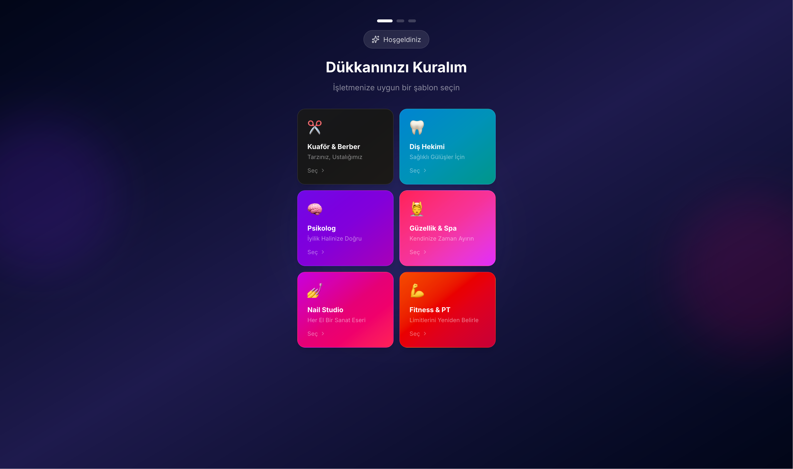
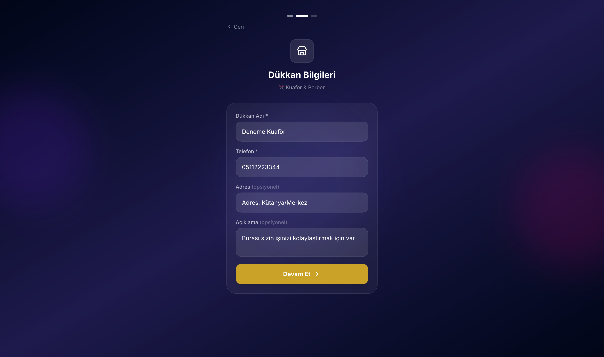
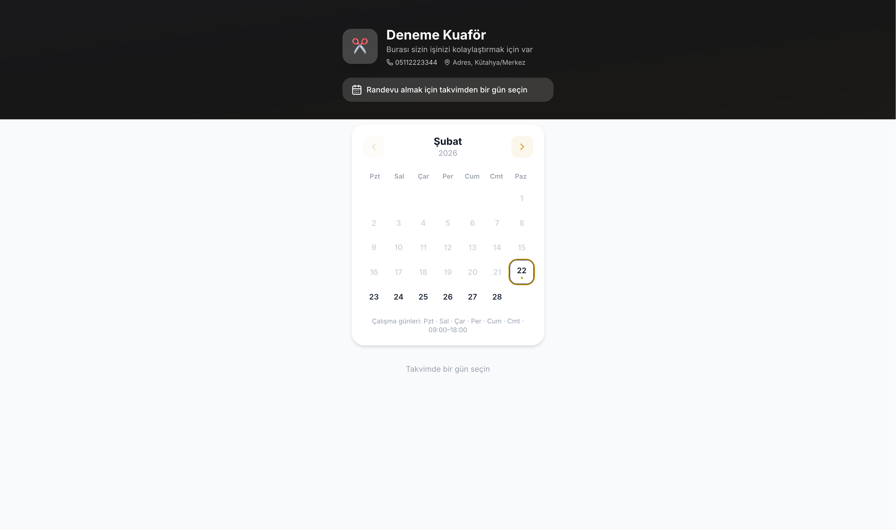

<div align="center">

<br/>

# ✨ Randevu Sistemi

### Dükkanınız İçin Modern Randevu Yönetimi

**Kurumu 30 saniye. Aylık ücret yok. Verileriniz sizde.**

<br/>

[🚀 Hemen Kur](#-kurulum) · [📸 Ekran Görüntüleri](#-ekran-görüntüleri) · [💡 Özellikler](#-özellikler) · [🔌 Entegrasyonlar](#-webhook-entegrasyonu)

<br/>

---

</div>

<br/>

## 🎯 Neden Randevu Sistemi?

| ❌ Diğer Çözümler           | ✅ Randevu Sistemi          |
| --------------------------- | --------------------------- |
| Aylık abonelik ücreti       | **Tamamen ücretsiz**        |
| Veriler başka sunucularda   | **Kendi sunucunuzda**       |
| Karmaşık kurulum            | **Tek komutla hazır**       |
| Gereksiz özellik kalabalığı | **Sade, amaca yönelik**     |
| İnternet kesilirse çalışmaz | **PWA — çevrimdışı destek** |

<br/>

## 📸 Ekran Görüntüleri

### 🏪 Kurulum Sihirbazı

> İşletmenize uygun şablonu seçin, birkaç bilgi girin — hazırsınız!

<p align="center">

</p>

Kuaför, diş hekimi, psikolog, güzellik salonu, nail studio, fitness... **6 farklı sektör şablonu** ile dükkanınıza özel renkler ve hizmetler otomatik oluşur.

<p align="center">

</p>

<br/>

### 📱 Müşteri Randevu Ekranı

> Müşterileriniz takvimden gün seçer, saat seçer, bilgilerini girer — bitti!

<p align="center">

</p>

<p align="center">

</p>

- ✅ Hizmet seçimi (Saç Kesimi, Sakal Düzeltme, Fön...)
- ✅ Müsait saatleri otomatik hesaplar
- ✅ Geri gelen müşteriyi telefon numarasından tanır
- ✅ Mobil uyumlu tasarım

<br/>

### 🎛️ Admin Yönetim Paneli

> Randevuları onaylayın, müşterilerinizi görün, webhook'larınızı yönetin.

<p align="center">

</p>

- 📅 **Takvim görünümü** — aylık randevu haritası
- 👥 **Müşteri listesi** — randevu sayıları ve iletişim bilgileri
- 🔔 **Anlık bildirimler** — yeni randevu geldiğinde
- 🔗 **Webhook yönetimi** — harici sistemlere otomatik bildirim
- ⚙️ **Ayarlar** — çalışma saatleri, renkler, logo

<br/>

---

## 💡 Özellikler

<table>
<tr>
<td width="50%">

### 🏪 Dükkan Yönetimi

- 6 sektör şablonu
- Özelleştirilebilir renkler & logo
- Çalışma günleri ve saatleri
- Hizmet tanımlama (isim, süre, fiyat)

</td>
<td width="50%">

### 📅 Randevu Sistemi

- Takvim bazlı rezervasyon
- Otomatik müsaitlik hesaplama
- Randevu onay/red/tamamla akışı
- Çakışma kontrolü

</td>
</tr>
<tr>
<td>

### 👥 Müşteri Yönetimi

- Otomatik müşteri kaydı
- Telefon ile geri gelen müşteri tanıma
- Randevu geçmişi takibi
- Müşteri istatistikleri

</td>
<td>

### 🔌 Entegrasyonlar

- Webhook ile harici API tetikleme
- Randevu oluşturma & onay event'leri
- Secret key ile güvenli iletişim
- PWA desteği (ana ekrana ekle)

</td>
</tr>
</table>

<br/>

---

## 🚀 Kurulum

### Gereksinimler

- Linux sunucu (VPS, Raspberry Pi, vb.)
- Docker & Docker Compose

### Tek Komutla Kurulum

```bash
curl -L https://github.com/erdodo/randevu-sistemi/archive/refs/heads/main.tar.gz | tar xz && cd randevu-sistemi-main && sudo docker compose up -d --build
```

🎉 **Hepsi bu kadar!**

Tarayıcınızda `http://SUNUCU_IP:3031` adresine gidin → Kurulum sihirbazı sizi karşılayacak.

<br/>

### Ne Olur?

```
1️⃣  Dosyalar indirilir (~16 MB)
2️⃣  Docker imajı oluşturulur (~2 dk)
3️⃣  PostgreSQL veritabanı ayağa kalkar
4️⃣  Tablolar otomatik oluşturulur
5️⃣  Uygulama hazır! 🎉
```

<br/>

---

## 🔌 Webhook Entegrasyonu

Randevu oluşturulduğunda veya onaylandığında harici API'lere otomatik bildirim gönderin.

**Kullanım Senaryoları:**

- 📱 WhatsApp / Telegram botu ile müşteriye bildirim
- 📊 Google Sheets'e randevu kaydı
- 📧 E-posta gönderimi
- 🏷️ CRM'e müşteri ekleme
- 💬 Discord / Slack'e bildirim

**Payload Örneği:**

```json
{
  "event": "appointment_created",
  "timestamp": "2026-02-22T12:00:00.000Z",
  "data": {
    "customerName": "Ali Yılmaz",
    "customerPhone": "05551234567",
    "date": "2026-02-24",
    "time": "14:00",
    "service": { "name": "Saç Kesimi", "duration": 30, "price": 150 }
  }
}
```

<br/>

---

## 🛡️ Güvenlik & Gizlilik

- 🔒 **Veriler sizin sunucunuzda** — üçüncü tarafla paylaşılmaz
- 🔐 **Admin şifre korumalı** — yönetim paneline şifresiz erişilemez
- 🌐 **Tek açık port** — sadece web arayüzü dışarıya açık, veritabanı kapalı
- 🔑 **Webhook secret** — güvenli API iletişimi

<br/>

---

## 🛠️ Teknik Altyapı

| Katman         | Teknoloji                             |
| -------------- | ------------------------------------- |
| Frontend       | Next.js 16, React 19, Tailwind CSS v4 |
| Backend        | Next.js API Routes, Prisma 7          |
| Veritabanı     | PostgreSQL 16                         |
| Çalışma Ortamı | Docker, Node.js 20 Alpine             |
| PWA            | Service Worker, Web Manifest          |

<br/>

---

<div align="center">

### ⭐ Beğendiyseniz yıldız vermeyi unutmayın!

**[GitHub'da Görüntüle](https://github.com/erdodo/randevu-sistemi)**

<br/>

MIT Lisansı ile sunulmaktadır.

Geliştirici: [@erdodo](https://github.com/erdodo)

</div>
